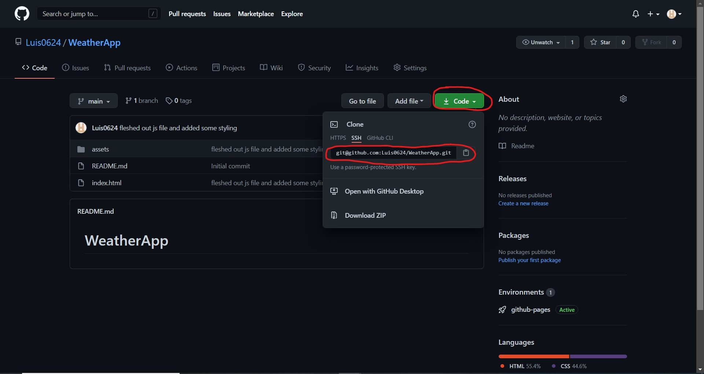
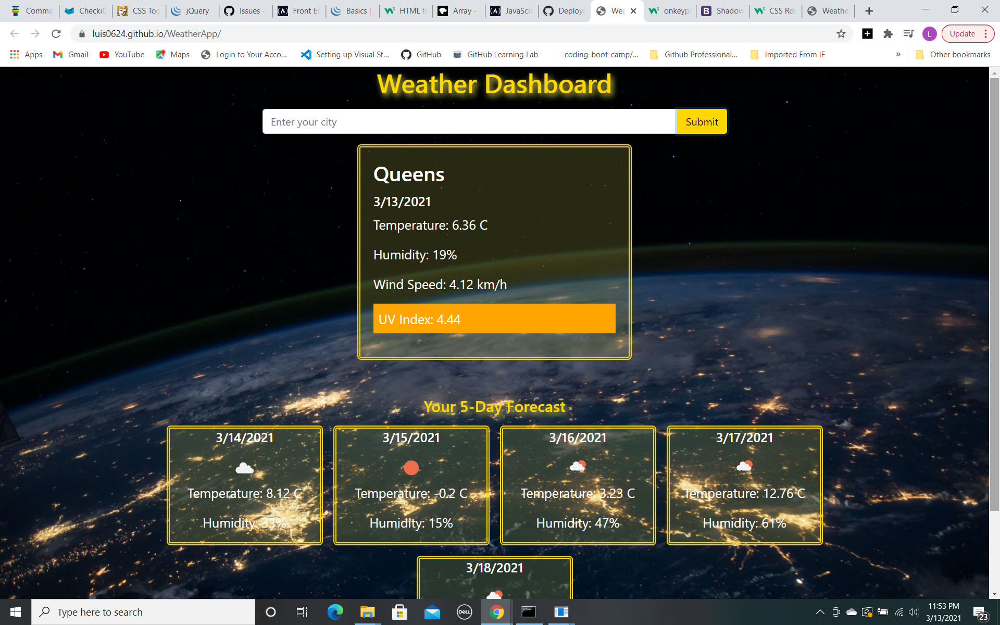

# WeatherApp

First attempt at using Javascript to make a Weather App

    With this weather app you are able to search for the weather by simplying typing in the city name in the search bar and click sumbit. Doing so will provide you with the current forecast in the city you input which includes the temperature, humidity wind speed and uv index for that day. it will also provide a 5 day forecast which includes temperature and humidity. 

  ### Weather App guidelines
  
  * click inside the search bar and input the name of the city that you would like to see the forecast of.

  * Then click on the sumbit button,

  * which will run the functions to retrieve the weather data from the api's,

  * which will then create cards to display the current forecast and the 5 day forecast.

  
### INSTALLATION
Use the following gitHub link [My Weather App](https://github.com/Luis0624/WeatherApp) to get to my github page and be able to clone the repo for my first daily planner.

Demo image for cloning github repo

[demo for cloning github repo]https://github.com/Luis0624/WeatherApp)

[deployed Github pages link](https://luis0624.github.io/WeatherApp/)

Sample image of deployed repo

After copying the ssh/https link open your terminal(MacOS) or Gitbash(Windows) and enter the command git clone "paste link here"
In your file finder open the folder that was created after cloning in the location you chose to clone the repo. Open the folder that was created with VS code(or any code editing program) and you should have the files and images that was used. 

### USAGE

Using VS code, or your choice of editor feel free to look through the HTML file,the CSS stylesheet and JS script. Contributions are welcome if they conform to the the following requirements:

* Refactoring suggestions can be made within comments above the code lines in question.
* Important: Use the Scout Rule, which recommends that you always leave the code a little cleaner than when you found it.
* If any code is changed please add a comment stating what was changed above the changed code.

### CREDITS

### LICENSE
  
